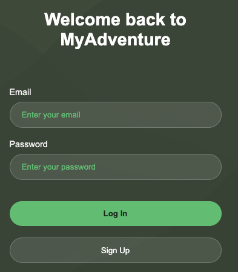
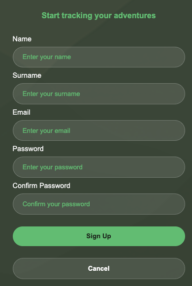
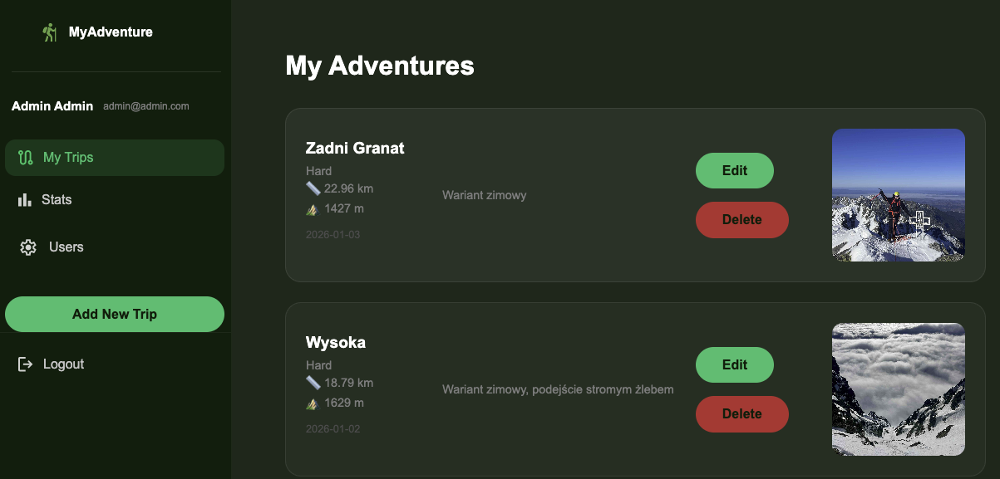
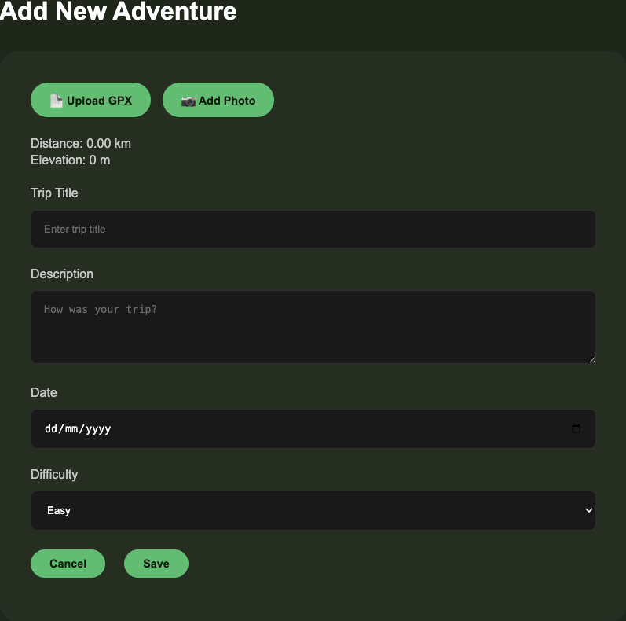
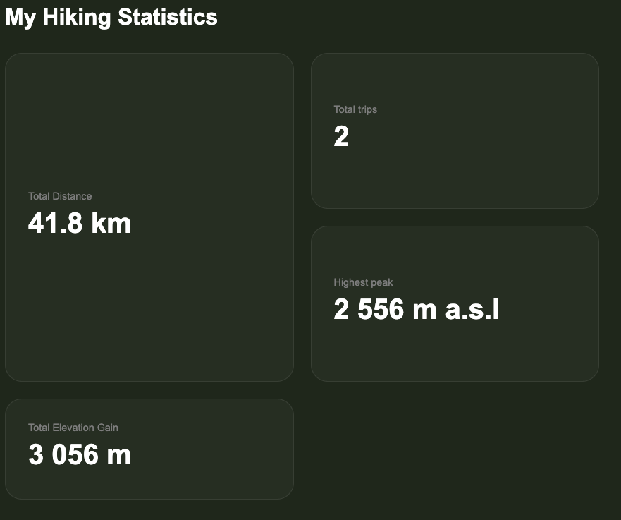
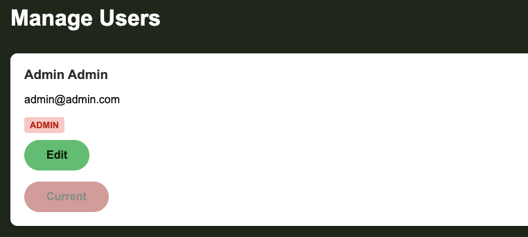
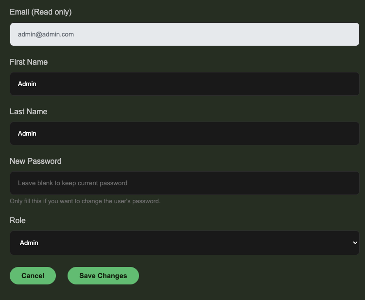
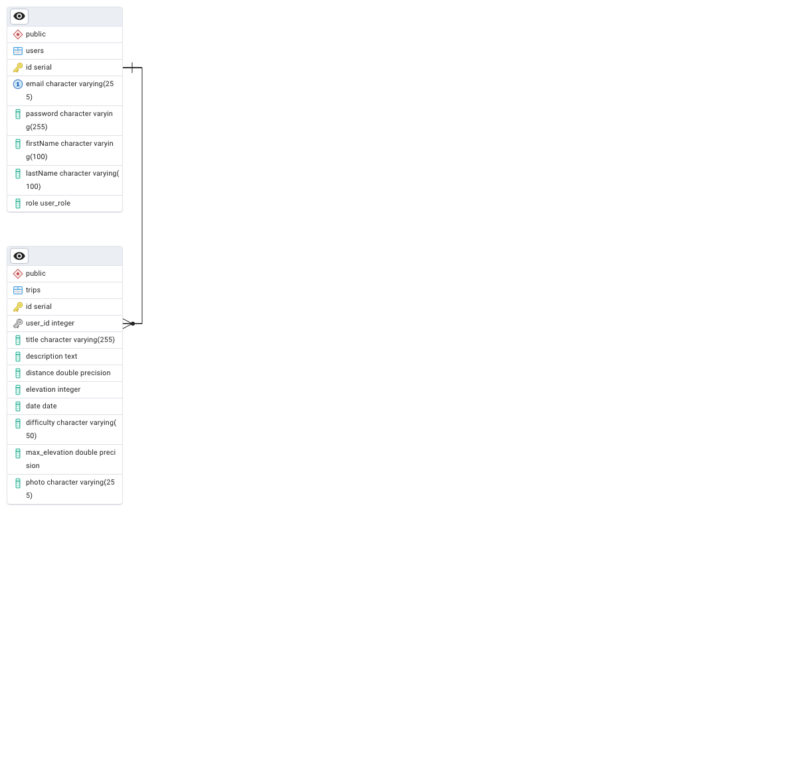

# MyAdventure 🌍

MyAdventure is a web application that allows users to track their trips, analyze statistics, and share their travel experiences. The project is built using **PHP** following the **MVC design pattern** and uses **PostgreSQL** as the database.

## 🚀 Features

### User Panel
* **Authentication:** Secure Login and Registration system.



* **Trip Management (CRUD):** Users can Add, Edit, and Delete their trips.
* **Photo Uploads:** Ability to upload photos for each trip.


* **Statistics:** Dashboard displaying total distance, elevation, and number of trips.


### Admin Panel
* **User Management:** Admin can view the list of all users.
* **Role Management:** Ability to promote users to Admins or delete accounts.



### Technical Highlights
* **MVC Architecture:** Clean separation of concerns (Model-View-Controller).
* **Client-side Validation:** JavaScript with Debounce for real-time form validation.
* **Security:** Password hashing (Bcrypt), session management, and PDO for SQL injection prevention.
* **Responsive Design:** Mobile-friendly interface.

## 🛠️ Tech Stack

* **Backend:** PHP 8.x
* **Database:** PostgreSQL
* **Frontend:** HTML5, CSS3, JavaScript (ES6)
* **Containerization:** Docker & Docker Compose


## 📂 Project Structure

```text
├── public/              # Publicly accessible files (assets)
│   ├── img/             # Static images
│   ├── uploads/         # User uploaded photos
│   ├── scripts/         # JavaScript files (Validation, AJAX)
│   └── styles/          # CSS stylesheets
├── src/
│   ├── controllers/     # Application logic (AppController, TripController, etc.)
│   ├── models/          # Data models (User, Trip)
│   ├── repository/      # Database interactions (UserRepository, TripRepository)
│   └── ...
├── docker-compose.yml   # Docker configuration
├── Routing.php          # URL routing logic
└── index.php            # Entry point
```

## 💾 Database Schema
